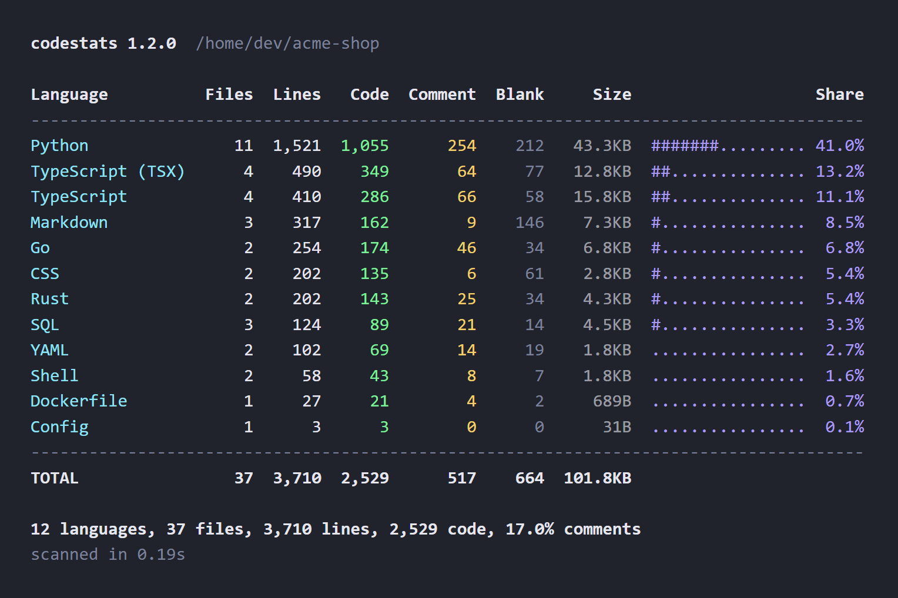
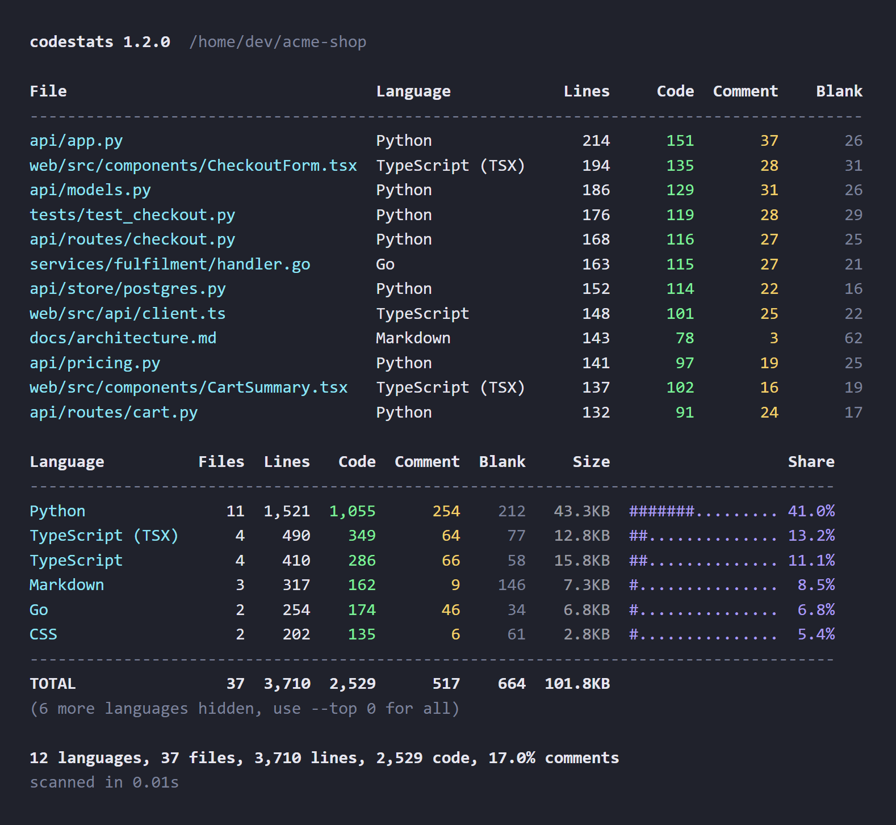

# codestats

[](https://github.com/Dynamic155/codestats/actions/workflows/tests.yml)
[](https://www.python.org/downloads/)
[](LICENSE)

A single Python file that counts the code in a project and prints a per-language breakdown: files, total lines, code, comments, blanks and size.

No install, no dependencies, no config file. Drop `codestats.py` into a project and run it.



## Quick start

Download the script and run it:

```bash
curl -O https://raw.githubusercontent.com/Dynamic155/codestats/main/codestats.py
python codestats.py
```

Or point it at any directory:

```bash
python codestats.py ~/code/myapp
```

The only requirement is Python 3.9 or newer. Everything comes from the standard library, so there is nothing to `pip install`.

## Why

Most line counters are either a Rust binary you have to install first, or a script that counts every line in `node_modules`. This one is a file you can copy into a repo, commit if you want, and run on a machine you do not control. It skips dependency directories, build output, lockfiles and binaries by default, and it reads `.gitignore` so the numbers reflect the code you actually wrote.

## Usage

```
python codestats.py [path] [options]
```

Common runs:

```bash
python codestats.py                                  # current directory
python codestats.py ../api --top 10                  # ten biggest languages
python codestats.py --sort comments                  # find the best documented code
python codestats.py --exclude 'tests/*'              # skip a subtree
python codestats.py --only '*.py' --per-file 20      # 20 largest Python files
python codestats.py --json > stats.json              # machine readable
```

### Per-file listing

`--per-file N` adds a table of the N largest files before the language summary. Leave off the number to list every file.



### JSON

`--json` prints the same numbers as a structured document, which makes it easy to track size over time or feed a dashboard. Adding `--per-file` includes a `files` array with one entry per file.

```json
{
  "root": "/home/dev/acme-shop",
  "generated_by": "codestats 1.2.0",
  "duration_seconds": 0.0061,
  "languages": {
    "Python": {
      "files": 11,
      "lines": 1521,
      "code": 1055,
      "comments": 254,
      "blanks": 212,
      "chars": 44368,
      "bytes": 44368
    }
  },
  "total": {
    "files": 37,
    "lines": 3710,
    "code": 2529,
    "comments": 517,
    "blanks": 664,
    "chars": 104289,
    "bytes": 104289
  },
  "skipped": {
    "unrecognized": 0,
    "binary": 0,
    "too_large": 0,
    "unrecognized_extensions": {}
  }
}
```

### CSV

`--csv` writes one row per language plus a `TOTAL` row, ready for a spreadsheet:

```csv
language,files,lines,code,comments,blanks,chars,bytes
Python,11,1521,1055,254,212,44368,44368
TypeScript (TSX),4,490,349,64,77,13150,13150
TypeScript,4,410,286,66,58,16207,16207
TOTAL,37,3710,2529,517,664,104289,104289
```

## Options

<details>
<summary>Full option list</summary>

```
positional arguments:
  path                  directory to scan (default: current directory)

options:
  -h, --help            show this help message and exit
  --version             show program's version number and exit

output:
  --json                print JSON instead of a table
  --csv                 print CSV instead of a table
  --per-file [N]        also list per-file counts (optionally only the top N)
  --top N               show only the top N languages (0 for all)
  --sort {blanks,code,comments,files,lines,name,size}
                        column to sort languages by (default: lines)
  --ascending           sort smallest first
  --no-bar              drop the share column
  --show-unknown        list the files and directories the scan left out
  --color {auto,always,never}
                        when to use colored output (default: auto)

filters:
  --exclude GLOB        skip paths matching this glob (repeatable)
  --only GLOB           count only paths matching this glob (repeatable)
  --ignore-dir NAME     extra directory name to skip (repeatable)
  --ignore-file NAME    extra exact file name to skip (repeatable)
  --ignore-ext EXT      extra extension to skip, e.g. .log (repeatable)
  --no-gitignore        ignore .gitignore rules
  --no-defaults         start from an empty ignore list instead of the built-in one
  --include-hidden      count dotfiles and dot-directories
  --max-size MB         skip files larger than this many megabytes
  --follow-links        follow symlinked directories
```

</details>

Color is on when the output is a terminal and off when it is piped to a file. `NO_COLOR` and `TERM=dumb` are respected, and `--color always` forces it on for tools that expect ANSI codes.

## What gets skipped

Three built-in lists near the top of the script decide what is not your code:

- `IGNORE_DIRS`: `node_modules`, `.venv`, `dist`, `build`, `target`, `vendor`, `Pods`, `.git`, editor and cache folders, and about fifty more.
- `IGNORE_FILES`: lockfiles such as `package-lock.json`, `Cargo.lock`, `poetry.lock`, `go.sum`.
- `IGNORE_EXTS`: images, fonts, archives, compiled objects, databases, minified bundles and source maps.

On top of that:

- `.gitignore` rules are applied, including negation with `!`, anchored patterns, directory-only patterns and `**`. A `.gitignore` in a subdirectory applies to that subtree only. Turn this off with `--no-gitignore`.
- Dotfiles and dot-directories are skipped unless you pass `--include-hidden`. Config directories that usually hold real work (`.github`, `.circleci`, `.gitlab`, `.husky`) are kept.
- Files whose first 8 KB contain a null byte are treated as binary and skipped, however friendly the extension looked.

Every list is a plain Python set at the top of the file. Editing them is the intended way to tune the tool for your projects, and `--ignore-dir`, `--ignore-ext` and `--exclude` cover one-off runs.

## A language is missing from the table

Run the scan again with `--show-unknown`. It prints every file the scan did not recognize, grouped by extension, along with the directories it walked past:

```
Unrecognized files (4)
add an extension to LANGUAGE_MAP to start counting these
------------------------------------------------------------
.pak                 2 files
    assets/core.pak
    assets/audio.pak
(no extension)       1 file
    CHANGELOG
.qqq                 1 file
    tools/notes.qqq

Skipped directories (2)
------------------------------------------------------------
  build, vendor
```

That splits the two causes apart. If the files appear under "Unrecognized", add their extension to `LANGUAGE_MAP`. If they do not appear at all, they sat inside a skipped directory, and the second list names it: `build`, `out`, `bin`, `obj`, `target` and `vendor` are ignored by default, which catches a fair amount of real source in C and C++ trees. Count them with `--no-defaults`, or keep the defaults and re-add the one you need:

```bash
python codestats.py --show-unknown          # what did it miss, and why
python codestats.py --no-defaults           # count everything, ignore lists off
python codestats.py --include-hidden        # count dotfiles too
```

The table footer names the top unrecognized extensions even without the flag, so `skipped: 20 unrecognized (.pak x9, .qqq x6, ...)` tells you where to look first.

## How lines are classified

Every line lands in exactly one of three buckets:

- **Blank**: nothing but whitespace, even inside a block comment.
- **Comment**: the line starts with a comment marker, or sits inside an open block comment.
- **Code**: everything else.

A comment after code on the same line (`value = 1  # note`) counts as code, which matches how most line counters report. Python docstrings count as comments. The classifier works marker by marker rather than parsing each language, so a comment marker inside a string literal can be misread. It is a well behaved heuristic for reporting on a codebase, not a lexer, and the numbers land within a percent or so of dedicated tools on ordinary source.

Comment syntax is defined per language in `COMMENT_SYNTAX`, which covers 117 of the 122 languages, with line markers (`#`, `//`, `--`, `%`, `;`, `"`) and block pairs (`/* */`, `<!-- -->`, `""" """`, `{- -}`, `(* *)`, `=begin =end`, and others).

## Languages

196 extensions map to 122 languages, from Python, TypeScript, Go, Rust, C, C++, C#, Java, Kotlin, Swift and PHP through to Elixir, Haskell, OCaml, Zig, Nim, Solidity and GDScript, plus markup, styles, config, SQL and shell.

Files named `Dockerfile`, `Makefile`, `Gemfile`, `Rakefile`, `CMakeLists.txt`, `Jenkinsfile` and friends are recognized by name. Extensionless scripts are identified from their shebang, so `#!/usr/bin/env python3` counts as Python.

For C and C++ specifically, that covers `.c`, `.h`, `.cpp`, `.cc`, `.cxx`, `.c++`, `.ipp`, `.tpp`, `.hpp`, `.hh`, `.hxx`, `.h++`, `.inl`, the module extensions `.ixx` and `.cppm`, CUDA `.cu` and `.cuh`, and Arduino `.ino`. The surrounding toolchain counts too: MSBuild project files, Visual Studio solutions, qmake, Meson, Ninja, autotools, `.rc` resources, `.def` module definitions, linker scripts, and HLSL, GLSL, Metal and WGSL shaders.

Two file names get resolved by content rather than by extension. A `.m` file is Objective-C or MATLAB depending on what is inside it, and a template such as `config.h.in` is counted as whatever it wraps, in that case a C header.

To add a language, add its extension to `LANGUAGE_MAP` and, if you want comment counts, an entry in `COMMENT_SYNTAX`.

## Tests

```bash
python -m unittest discover -s tests -v
```

60 tests cover language detection, comment and blank classification per comment style, `.gitignore` matching, the filters, the formatters and the command line. They run on every push through GitHub Actions.

## License

MIT. See [LICENSE](LICENSE).
